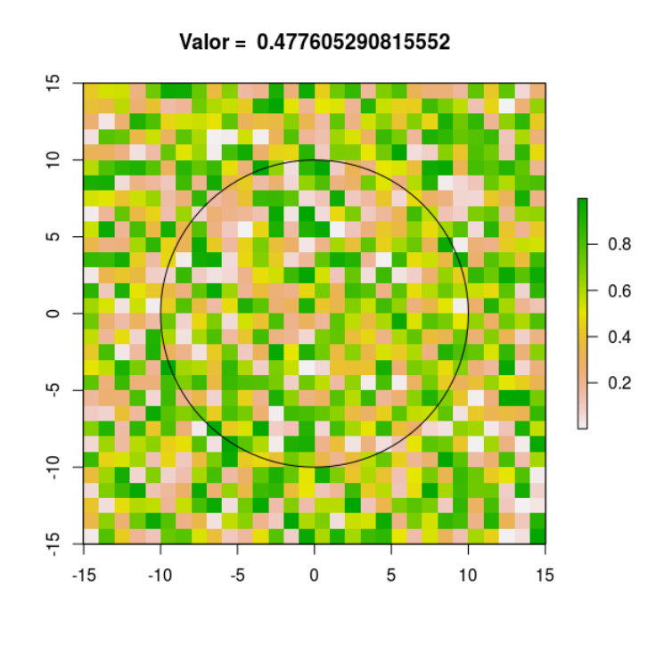
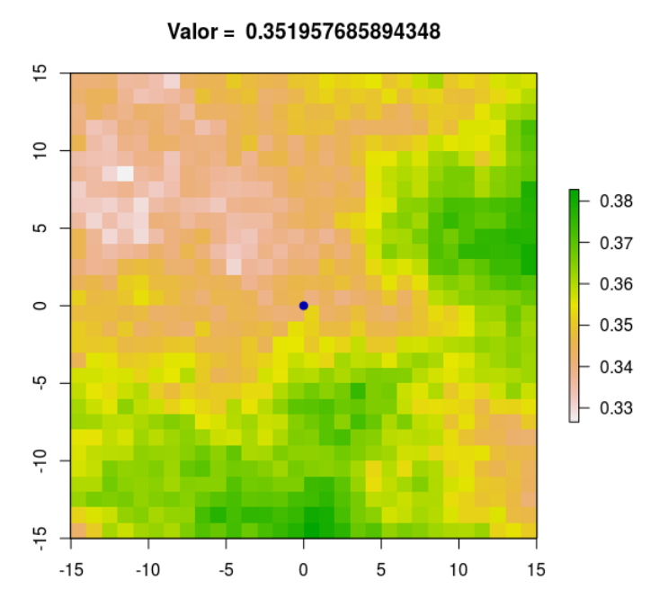

Economic and Ecological Restoration Meta Analysis Project

### Repository created to host all scripts used in Socio Economic and Ecological Restoration Meta Analysis

**General information:**  

#### :warning: Abour the analysis rounds:  
**Due to inconsistencies on the process a "fourth round" were done, changing the analysis structures, which were until that point linear, passing on each analysis round, and now all analysis is done in one unique process: the [fourth round](https://github.com/FelipeSBarros/RestorationMetaAnalysis#Fourth-Round)**  
 - [X] [Analysis validation](https://github.com/FelipeSBarros/RestorationMetaAnalysis#analysis-validation): Reproduce the same analysis done in Google Earth Engine on R to check the if results match;  
 - [X] [~~First Round Analysis~~](https://github.com/FelipeSBarros/RestorationMetaAnalysis#First-Round-Analysis): extract dataset values for different buffer sizes around study areas;  
 - [X] [~~Second Round Analysis~~](https://github.com/FelipeSBarros/RestorationMetaAnalysis#Second-Round-Analysis): as first round was done missing few datasets, the second round should be the final one and with all layers expected;
 - [X] [~~Workshop update~~](https://github.com/FelipeSBarros/RestorationMetaAnalysis#Workshop-updates): After second round, an update was done adding more layers considering workshop commets by specialists. :warning: **Updated on 08/12/2018**  
 - [X] [~~Preliminar output~~](https://github.com/FelipeSBarros/RestorationMetaAnalysis#Preliminar-Output)  
 - [X] [~~Third round~~](https://github.com/FelipeSBarros/RestorationMetaAnalysis#Third-Round)  
 - [X] [Fourth round - Revision](https://github.com/FelipeSBarros/RestorationMetaAnalysis#Fourth-Round)  

# Analysis Validation  

To certify all analysis have been done correctly, a random study site was selected to run same analysis using R stats.
For results, [click here](https://felipesbarros.github.io/RestorationMetaAnalysis/R/AnalysisValidation.html)  

Another validation was done to confirm if focal kenrel were done considering de pixel centroid:
A variable was selectect and sampled its values for a points. With the same point we sampled the pixel value after a focal kernel with radius equals the pixel size. As the result was the same, qe qill disconsider the radius for the focal kernel with the same pixel size.

[GEE script](https://code.earthengine.google.com/3f54b3bd1eee02f061045fc3b4a45b16)  

# First Round Analysis (desconsider)

The statistics used for Ecological data where *mean* (\*_mean) and *standard deviation* (\*_stdDev);
The dataset were composed by:

* [Net Primary Production](http://dx.doi.org/10.5067/MODIS/MOD17A3H.006)  
  * **NPP0010** =  2000 - 2010
  * **NPP03** = 2003
* [Water Deficit](https://www.nature.com/articles/sdata2017191)  
  * **WDeficit8910** = 1989 - 2010
  * **WDeficit03** = 2003
  * **WDeficit99** = 1999
* [Hansen v:1.5](http://earthenginepartners.appspot.com/science-2013-global-forest)
  * **treecover2000** = Tree Cover Density year 2000  
* [World Clim](http://www.worldclim.org/version1)  
  * **YrlPrec** = Mean Precipitation
  * **DriestQuartes** = Driest Quarter (*bio 17*)
  * **PrecSeanslty** = Precipitation Seasonality (*bio 15*)
* [Soil Grid](https://soilgrids.org/)  
  * **CEC** = Cation Exchange (see [cec](http://journals.plos.org/plosone/article?id=10.1371/journal.pone.0169748))
* Opportunity Cost  
  * **OppCost** = Created by
* [ESA Globe Cover](http://due.esrin.esa.int/page_globcover.php)  
  * **UrbArea2019** = Urban Areas 2009  

[Link to GEE analysis script](https://code.earthengine.google.com/d180ea0cdd8d61de0880a2ef0a297422)

### 1st Round Results  (desconsider)
 :arrow_double_down: [~~Buffer 5Km~~](https://felipesbarros.github.io/RestorationMetaAnalysis/R/results_Buffer5.csv)  
 :arrow_double_down: [~~Buffer 10Km~~](https://felipesbarros.github.io/RestorationMetaAnalysis/R/results_Buffer10.csv)  
 :arrow_double_down: [~~Buffer 25Km~~](https://felipesbarros.github.io/RestorationMetaAnalysis/R/results_Buffer25.csv)  
 :arrow_double_down: [~~Buffer 50Km~~](https://felipesbarros.github.io/RestorationMetaAnalysis/R/results_Buffer50.csv)  
 :arrow_double_down: [~~Buffer 100Km~~](https://felipesbarros.github.io/RestorationMetaAnalysis/R/results_Buffer100.csv)  

# Second Round Analysis (desconsider)  

 where added to the analysis the variables:

 * [Human Foot Print](http://sedac.ciesin.columbia.edu/data/set/wildareas-v2-human-footprint-geographic)  
    * **HFPrint** = 1995 - 2004
 * [Urban Area - ESA Globe Cover](http://due.esrin.esa.int/page_globcover.php)  
    * **PercUrbArea09** = Percentual de area urbana 2009  
 * [Rural poverty distribution](http://www.fao.org/geonetwork/srv/en/main.home#)  
    *   **RuralPvty** = ?  
  :warning: *Search for "Global distribution of rural poor population" on the search window*;
  :warning: *This layer had its pixels with negative values (e.g. -998) reclasifyed to 0 as it seems to be indicating nodata areas = Urban Area*;
 * [ Rural population distribution (persons per pixel), 2000 (FGGD)](http://www.fao.org:80/geonetwork/srv/en/resources.get?id=14031&fname=Map_2_1.zip&access=private)  
    * **RuralPop** = 2007  
 * [ Hansen tree cover](http://earthenginepartners.appspot.com/science-2013-global-forest)  
    * **f2003** = 2003
    * **ForestUntl10** = 2000 - 2010
 * [ Global Roads Inventory Project - GRIP - version 4](https://doi.org/10.1088/1748-9326/aabd42)  
    * **TotalRoadDensity** = density for all roads, equally weighted  
    * **T1RoadDensity** = density for GRIP type 1 - highways  
    * **T2RoadDensity** = density for GRIP type 2 - primary roads  
    * **T3RoadDensity** = density for GRIP type 3 - secondary roads  
    * **T4RoadDensity** = density for GRIP type 4 - tertiary roads  
    * **T5RoadDensity** = density for GRIP type 5 - local roads  

# Workshop updates  
Wokshop held in Rio de JAneiro - IIS on 29/10/2018  
* [IDH](https://datadryad.org/resource/doi:10.5061/dryad.dk1j0)  
   * **IDH03** = IDH value for 2003
   * **IDH9017** = mean IDH value between 1990 - 2017  
* Normalized Burn Ratio  
#GEE - LANDSAT/LC8_L1T_ANNUAL_NBRT  
    * **NBR1317** = mean NBR value between 2013 - 2017
* Burn Area Index  
#GEE - LANDSAT/LC8_L1T_ANNUAL_BAI  
    * **BAI1317** = mean BAI value between 2013 - 2017  
* [CropLands](https://geography.wr.usgs.gov/science/croplands/
)  
    * **CropLands** = crop/non cropland;  
* [Croplands & Pastures](http://sedac.ciesin.columbia.edu/data/set/aglands-pastures-2000)  
    * **PastAgric** = Percentage of cropland OR agriculture;  
:warning: Seems to be wrong. As the link shows, the layer is just for pasture;  

* [Elevation SRTM 30m](https://lpdaac.usgs.gov/sites/default/files/public/measures/docs/SRTM%20Quick%20Guide.pdf)  
    * **Elevation** = mean elevation in meters;
* [Slope](https://developers.google.com/earth-engine/api_docs#eeterrainslope)  
    * **Slope** = mean slope in degrees  
* [Curtis et al. (**Commodities**)](http://science.sciencemag.org/content/suppl/2018/09/12/361.6407.1108.DC1)  
    * **Commodity-driven Deforestation: cdd** = Perc Commidity driven deforestation  
    * **Shifting Agriculture: sa** =  Perc Argriculture driven deforestation  
    * **Forestry: fty** =  Perc Forestry driven deforestation  
    * **Wildfire: wfire** = Perc Wildfire driven deforestation  
    * **Urbanization: urb** = Perc Urban driven deforestation  
* **IIS Opportunity cost**  
    * OpCostIISmasked  
    * OpCostIIS  
* **IIS Landuse**  
    * cropIIS  
    * pastoIIS  
    * croppastureIIS  
* [Governance](http://www.govindicators.org)
    * govrnce = governance  
    Government Effectiveness captures perceptions of the quality of public services, the quality of the civil service and the degree of its independence from political pressures, the quality of policy formulation and implementation, and the credibility of the government's commitment to such policies
* [Migration]  
    * deltaGHSL9015 [1990 - 2015]:  Migration estimated from [GHSL: Global Human Settlement Layers](http://ghsl.jrc.ec.europa.eu/ghs_pop.php)   
    * deltaGPWCount0010 [2000 - 2010]: [GPWv4: Population Count](https://doi.org/10.7927/H4X63JVC)  
    * deltaGPWDensity0010: Migration estimated from [GPWv4: Population Density](https://doi.org/10.7927/H4NP22DQ)  
* [WDPA: World Database on Protected Areas](http://pp-import-production.s3.amazonaws.com/WDPA_Manual_1_5.pdf):  
    * strictlyPA: Strictly Protected Areas  
    * SustainablePA: Sustainable Protected Areas  
* Gross Deforestation (Hansen based)  
    * GrossDef: Total deforested until 2010  
* Mean Temperature [World Clim](http://www.worldclim.org/version1)  
    * AnualTemp: Anual mean temperature  
* [Soil Data](https://soilgrids.org/)  
    * bldfie = bulkdensity  
    * phihox = phihox  
    * phikcl  
    * sndppt: Sand   
*  
 [Link to GEE analysis script](https://code.earthengine.google.com/c64a926e7f0958f9522beb30ec4702fa)

### 2nd Round [workshop] Results  
  :arrow_double_down: [~~Buffer 5Km~~](https://felipesbarros.github.io/RestorationMetaAnalysis/R/2ndRound_results_Buffer5.csv)  
  :arrow_double_down: [~~Buffer 10Km~~](https://felipesbarros.github.io/RestorationMetaAnalysis/R/2ndRound_results_Buffer10.csv)  
  :arrow_double_down: [~~Buffer 25Km~~](https://felipesbarros.github.io/RestorationMetaAnalysis/R/2ndRound_results_Buffer25.csv)  
  :arrow_double_down: [~~Buffer 50Km~~](https://felipesbarros.github.io/RestorationMetaAnalysis/R/2ndRound_results_Buffer50.csv)  
  :arrow_double_down: [~~Buffer 100Km~~](https://felipesbarros.github.io/RestorationMetaAnalysis/R/2ndRound_results_Buffer100.csv)  

# Preliminar Output  
After predictive selection done using randomForest algorithm on R, a preliminar predictive of the Landscape Variation were ran by biodiversity group (i.e. flora, vertebrates and invertebrates) on GEE - link to model;  
~~But during this process an inconsistency was found: estimate the mean value of a predictive value considering a buffer radii is not the same as estimating the value of the same layer after a "moving window" with the same radii of a buffer centroid. This could be proved by a R reproducible script simulating a random variable and estimating both scenarios, wheres each gave a different result.~~  
{ width=50% }  
{ width=50% }  

~~Although the inconsistency found,~~ the preliminary result were executed.  
:warning: The 'inconsistency' above mentioned were discussed and were realized that:  
 * The focal process developed on R is quite "different" from expected;
 * The focal process on GEE had the expected value;  

According to Hawthorne, the issue with R's focal implementation can be overcome with the code snippet:  
```r
focal(striclyPA, kernel, "sum", na.rm=TRUE) / sum(kernel)
```  

Thus the process to be run will all be done in GEE;  

# Third Round (desconsider)  
~~As a inconsistency was found ([read above](https://github.com/FelipeSBarros/RestorationMetaAnalysis#Preliminar-Output)) this round aimed to get the predictive values of all points for each biodiversity group after running the "moving windows".~~  

~~[Link to GEE analysis script](https://code.earthengine.google.com/a387060663977d668e2a6e37f819c758)~~  

After back and forth to understand the issues reported on ([preliminar output](https://github.com/FelipeSBarros/RestorationMetaAnalysis#Preliminar-Output)) we found that:  

1. *focal* algorithm implemented on R has a issue wich makes values quite different from the point buffer approach;  
1. We could confirm that this issue is not present on GEE; Thus, all the process will be done on GEE and using the point buffer approach to fit randomForest Model (already done); On R/GDAL/QGIS we will only do few post-processing steps;  
  * Mosaic model/mask;  
  * Warp to the study area limit model/mask;  
  * Map layout;  

* Link to GEE analysis script:  
    * [~~Flora script~~](https://code.earthengine.google.com/b5af556081a37c77a99460a1dca45da8)  
    * [~~Invertebrades script~~](https://code.earthengine.google.com/3724e23d1310fc42235bc3d36c262f17)  
    * [~~Vertebrades script~~](https://code.earthengine.google.com/be015bb15e7d41a2499de4f4db2e19e5)  

### Unpredictable mask (desconsider)  
* [~~Flora~~](https://code.earthengine.google.com/68b19aeab30909fbce9d2ff6ec27b02a)  
* [~~Invertebrades~~](https://code.earthengine.google.com/9999960fb6ba8b7e4ae5a9cb8734e7c6)  
* [~~Vertebrades~~](https://code.earthengine.google.com/8b992d5ea994068960269dd09f957e6c)  

### 3rd Round Statistics Results (desconsider)  
  :arrow_double_down: [~~Flora~~](https://felipesbarros.github.io/RestorationMetaAnalysis/R/LandscapeVarBiomes_Flora.csv)  
  :arrow_double_down: [~~Invertebrates~~](https://felipesbarros.github.io/RestorationMetaAnalysis/R/LandscapeVarBiomes_Invertebrates.csv)  
  :arrow_double_down: [~~Vertebrates~~](https://felipesbarros.github.io/RestorationMetaAnalysis/R/LandscapeVarBiomes_Vertebrates.csv)  

# Fourth Round:  
All process were done in **GEE**. The script can be found [here](https://code.earthengine.google.com/c64977db5355dadea8a4a01be5cc98d5);
During the validation process, few changes occured:  

1. Study site 181 was descinsidered due its location doesn't fit the layer resolution;  
1. Layers with orignal resolution lower than 1Km had to be resampled to 1Km so GEE could afford all focal radius (see below a list of those layers);  
1. We are estimating only urban areas from [Globe Cover](http://due.esrin.esa.int/page_globcover.php). The ESA layer presented problem during the process;  
1. The Opportunity Cost layer had to be unmasked. So, non restorable sites present 0 opportunitycost; Also we added a sum of Opportunity Cost.  
1. Pasture layer where removed due conceptual inconsistency.  
1. Sustainabile Protected Area. had problem on estimation.  

### 4th Round Statistics Results
  :arrow_double_down: [All groups](https://felipesbarros.github.io/RestorationMetaAnalysis/Data/results/Biodiversity_Revision.csv)    

**Layers with rasolution lower than 1Km:**  

**30 m**
* grossdef  
* slope  
* yearMeanUntil10  
* f2003  
* Elevation  
* treeCover  

**250 m**  
* deltaGHSL9015  

**300 m**  
* cropIIS  
* pastoIIS  
* CropPastoIIS  
* UrbCover  

**500 m**  
* MeanNPP0010  
* NPP03  


# Scripts  

## R  

* [Cation Exchange Capacity](https://github.com/FelipeSBarros/RestorationMetaAnalysis/blob/master/R/Calculating_SoilCEC.R)  
* [1st round data organization](https://github.com/FelipeSBarros/RestorationMetaAnalysis/blob/master/R/Organizing1stRoundSats.R)  
* [2nd round data organization](https://github.com/FelipeSBarros/RestorationMetaAnalysis/blob/master/R/Organizing2ndRoundSats.R)  
* [Buffer VS Moving Window estimates](https://github.com/FelipeSBarros/RestorationMetaAnalysis/blob/master/R/BufferMovingWindow.R)  
* [3rd round data organization](https://github.com/FelipeSBarros/RestorationMetaAnalysis/blob/master/R/Organing3rdRoundStat.R)  

## GDAL  

* [pos-processing scripts](https://github.com/FelipeSBarros/RestorationMetaAnalysis/blob/master/Bash/gdal_Scripts)  


# References  

* **Cation Exchange Capacity:** [Hengl et al. 2017](http://journals.plos.org/plosone/article?id=10.1371/journal.pone.0169748)  
* **Urban Area:** [ESA global LC maps at 300 m spatial resolution on an annual basis from 1992 to 2015;](http://maps.elie.ucl.ac.be/CCI/viewer/download.php)  
  * [User guide](http://maps.elie.ucl.ac.be/CCI/viewer/download/ESACCI-LC-QuickUserGuide-LC-Maps_v2-0-7.pdf)  
* **Global Road Density Rasters::** [Meijer et al 2018 Environ. Res. Lett](https://doi.org/10.1088/1748-9326/aabd42)  
* **"The Worldwide Governance Indicators:  Methodology and Analytical Issues"**.  World Bank Policy Research Working Paper No. 5430 (http://papers.ssrn.com/sol3/papers.cfm?abstract_id=1682130).  The WGI do not reflect the official views of the Natural Resource Governance Institute, the Brookings Institution, the World Bank, its Executive Directors, or the countries they represent."  
* Center for International Earth Science Information Network - CIESIN - Columbia University. 2016. **Gridded Population of the World, Version 4 (GPWv4): Population Density**. Palisades, NY: NASA Socioeconomic Data and Applications Center (SEDAC). https://doi.org/10.7927/H4NP22DQ. Accessed DAY MONTH YEAR.  
* Center for International Earth Science Information Network - CIESIN - Columbia University. 2016. **Gridded Population of the World, Version 4 (GPWv4): Population Count**. Palisades, NY: NASA Socioeconomic Data and Applications Center (SEDAC). https://doi.org/10.7927/H4X63JVC. Accessed DAY MONTH YEAR.  
* European Commission, Joint Research Centre (JRC); Columbia University, Center for International Earth Science Information Network - CIESIN (2015): **GHS population grid, derived from GPW4, multitemporal (1975, 1990, 2000, 2015)**. European Commission, Joint Research Centre (JRC) [Dataset] PID: http://data.europa.eu/89h/jrc-ghsl-ghs_pop_gpw4_globe_r2015a  
* UNEP-WCMC and IUCN (year), **Protected Planet: The World Database on Protected Areas (WDPA)** [On-line], [insert month/year of the version used], Cambridge, UK: UNEP-WCMC and IUCN Available at: www.protectedplanet.net.  
* http://www.fao.org/docrep/009/a0310e/a0310e00.htm  
